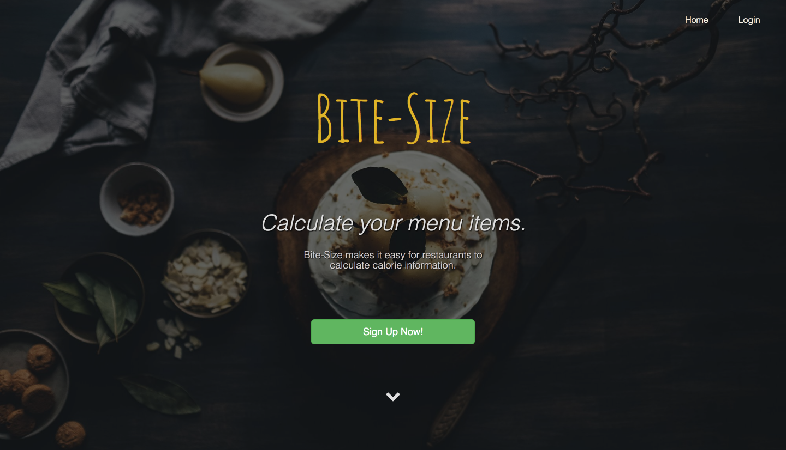

# Bite-Size

My final project at The Iron Yard.

[See the project live here.](https://arydavani.github.io/recipe-final-project/)

## Document

### Elevator

  "Americans eat and drink about one-third of their calories away from home. Making calorie information available on chain restaurant menus will help consumers make informed choices for themselves and their families" -FDA

### Solution

  Data-Bites allows restaurants to calculate the calorie information of their menu items, using bulk recipes.

### Technologies

  - mongoDB (Parse Server)
  - React
  - Bootstrap UI
  - Nutritionix API

### Features

  - Natural query language allows users to copy and paste recipes, regardless of format.
  - Nutrition label calculated for each menu item.
  - Easily print nutrition label and full ingredients list.
  - Shareable link

### User stories

  - As someone who is enjoys a healthy lifestyle, I want to be able to make healthy choices when I go out to eat.
  - As someone who is on a strict diet, I need to keep track of how many calories I consume.
  - As a restaurant owner, I want to show that I have healthy options on my menu.
  - As a chef, I want to easily add and edit recipes in one place.
  - As a chef and kitchen manager, I want to be able to print off new recipes for my staff.
